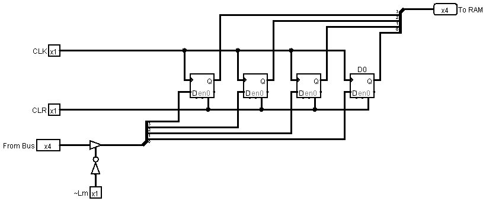
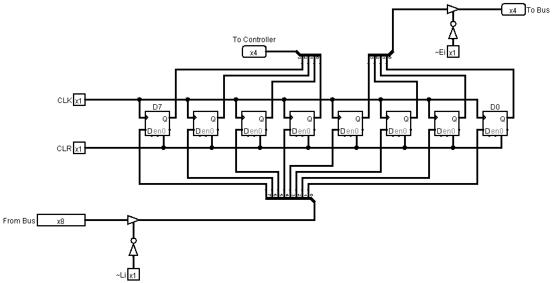
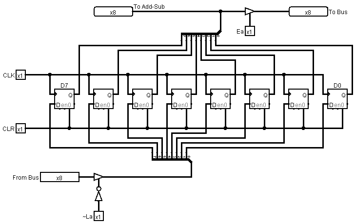
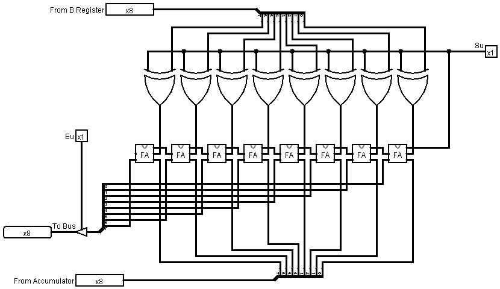
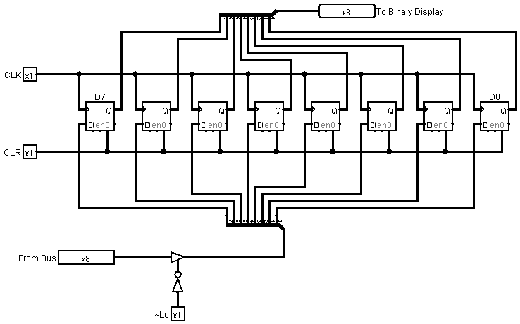
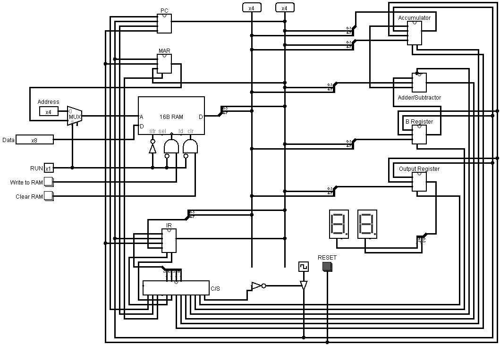

# SAP-1 Educational Computer

A complete recreation of the **SAP-1 (Simple As Possible-1) computer** in **Logisim** with experimental **Verilog HDL** implementations. This project is based on the architecture described in *Digital Computer Electronics* by Albert Paul Malvino and Jerald A. Brown.

The repository serves as a hands-on tool to understand basic CPU components, instruction execution, and digital design principles.

---

## 📁 Repository Structure

```
SAP-1/
├── logism/                     # Logisim circuit files
├── verilog/                    # Experimental Verilog HDL implementations
└── images/                     # Screenshots of circuits
```

---

## 🖥️ Logisim Implementation

The **`SAP-1.circ`** file contains the **completed SAP-1 computer circuit**, including all sub-circuits:

- Program Counter (PC)
- Memory Address Register (MAR)
- Random Access Memory (RAM)
- Instruction Register (IR)
- Accumulator (ACC)
- Arithmetic Logic Unit (ALU)
- Output Register
- Control Logic / Timing Signals

The circuit is fully functional in Logisim and supports the SAP-1 instruction set:

- `LDA` – Load value from memory into ACC  
- `ADD` – Add value from memory to ACC  
- `SUB` – Subtract value from memory from ACC  
- `OUT` – Output ACC value  
- `HLT` – Halt execution

---

### Program Counter (PC)
<!--  -->
**Description:** Increments the memory address each clock cycle to fetch the next instruction.

### Memory Address Register (MAR)
  
**Description:** Holds the address of the memory location to read/write data.

### Instruction Register (IR)
  
**Description:** Stores the current instruction fetched from memory for decoding and execution.

### Accumulator (ACC)
  
**Description:** Main register used by the ALU to perform arithmetic and store results.

### Arithmetic Logic Unit (ALU)
  
**Description:** Performs arithmetic operations (ADD, SUB) on the ACC and input values.

### Output Register
  
**Description:** Holds the data to be outputted to the display or other external devices.

### Full SAP-1 Circuit
  
**Description:** Complete integration of all sub-circuits forming the functional SAP-1 computer.

---

## 💻 Verilog Implementation

The **`verilog/`** folder contains experimental **Verilog HDL implementations** of SAP-1 components. These files provide a digital logic model of the CPU and are intended for simulation and experimentation.

---

## 🔧 How to Use

### Logisim
1. Install [Logisim Evolution](https://github.com/reds-heig/logisim-evolution).  
2. Open `logism/SAP-1.circ` in Logisim.  
3. Run simulations, load instructions, and observe CPU behavior.

### Verilog
1. Use a Verilog simulator such as **ModelSim**, **Vivado**, or **Icarus Verilog**.  
2. Compile the files in the `verilog/` folder.  
3. Simulate components individually or integrate to model CPU behavior.

---

## 📚 References

- Malvino, Albert Paul & Brown, Jerald A. *Digital Computer Electronics*, 6th Edition.  
- [Logisim Evolution](https://github.com/reds-heig/logisim-evolution) – Open-source digital circuit simulator.
- https://github.com/KarenOk/SAP-1-Computer

---

## 📝 License

This project is released under the **MIT License**. See the [LICENSE](LICENSE) file for details.
